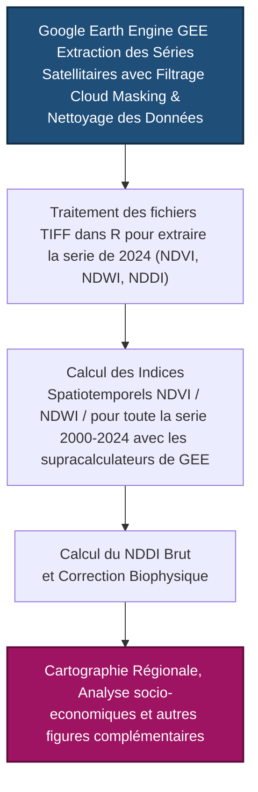

# Cartographie de la sévérite de la sechéresse au Maroc par Télédétection (2000-2024)

Ce dépôt héberge le code source et la méthodologie de l'application de suivi du stress hydrique au Maroc, développée dans le cadre de l'évaluation des politiques publiques. Ce projet s'appuie sur l'extraction de séries satellitaires et le calcul d'indices biophysiques pour cartographier la sévérité de la sécheresse à l'échelle régionale.

## 🛠️ Pipeline Méthodologique



## 📊 Données & Résultats Réglés (2024)

Le tableau suivant présente les valeurs de l'Indice Différentiel de Sécheresse Normalisé (NDDI) calculées pour l'année 2024, ainsi que leur interprétation comparative selon deux approches de classification :

| Région | Valeur NDDI brute | Statut (Seuils Absolus) | Statut (Artikanur et al., 2022) |
| :--- | :---: | :---: | :---: |
| **Marrakech-Safi** | `1.8681` | ≥ 0.5 (Sécheresse extrême) | [1.25 ; 3[ (Élevée) |
| **Rabat-Salé-Kénitra** | `1.8530` | ≥ 0.5 (Sécheresse extrême) | [1.25 ; 3[ (Élevée) |
| **Béni Mellal-Khénifra** | `1.6850` | ≥ 0.5 (Sécheresse extrême) | [1.25 ; 3[ (Élevée) |
| **Fès-Meknès** | `1.4411` | ≥ 0.5 (Sécheresse extrême) | [1.25 ; 3[ (Élevée) |
| **Tanger-Tétouan-Al Hoceima** | `0.8928` | ≥ 0.5 (Sécheresse extrême) | [0.7 ; 1.25[ (Modérée) |
| **Dakhla-Oued Ed-Dahab** | `0.6000` | ≥ 0.5 (Sécheresse extrême) | [-2 ; 0.7[ (Faible) |
| **Drâa-Tafilalet** | `0.6000` | ≥ 0.5 (Sécheresse extrême) | [-2 ; 0.7[ (Faible) |
| **Guelmim-Oued Noun** | `0.6000` | ≥ 0.5 (Sécheresse extrême) | [-2 ; 0.7[ (Faible) |
| **Laâyoune-Sakia El Hamra** | `0.6000` | ≥ 0.5 (Sécheresse extrême) | [-2 ; 0.7[ (Faible) |
| **Souss-Massa** | `0.6000` | ≥ 0.5 (Sécheresse extrême) | [-2 ; 0.7[ (Faible) |
| **l'Oriental** | `0.6000` | ≥ 0.5 (Sécheresse extrême) | [-2 ; 0.7[ (Faible) |
| **Casablanca-Settat** | `0.1475` | < 0.2 (Pas de sécheresse) | [-2 ; 0.7[ (Faible) |

> 💡 **Note technique sur l'ajustement biophysique :** Les régions du Sud et certaines zones arides subissent un seuillage restrictif fixe à `0.6` (lorsque $NDVI < 0.15$ et $NDWI < 0$) afin d'éviter la saturation mathématique induite par les sols nus.

## 🚀 Fonctionnalités du Code R

* **Alignement Géospatial :** Jointure et harmonisation des données de télédétection avec le découpage officiel des 12 régions du Maroc.
* **Légendes Stables :** Forçage de l'affichage de l'intégralité des palettes de couleurs dans les légendes (`drop = FALSE` et configuration des `limits`), assurant la lisibilité des classes même si elles ne sont pas représentées sur la carte.
* **Visualisation Avancée :** Cartes thématiques prêtes pour l'intégration dans le tableau de bord décisionnel.

## 📦 Dépendances et Installation

Pour reproduire les analyses et générer les graphiques, assurez-vous de disposer des packages R suivants :

```R
install.packages(c("ggplot2", "sf", "ggspatial", "igraph", "dplyr","tidyverse", "raster", 
                   "terra", "sp", "rgdal", "lubridate"))
```

## Structure du projet
```
├── .gitignore # Fichiers ignorés par Git
├── README.md # Présentation du projet
├── Stage Stress Hydrique Maroc.Rproj # Projet RStudio
├── 01_preparation_donnees.R # Script préparation données
├── importation et calcul des stats.R # Script analyses stats
├── donnees_satellites/ # Données brutes (ignoré)
├── shapefile_maroc/ # Shapefiles Maroc
└── sorties_figures/ # Figures et résultats
```

## Statut
🚧 Projet en cours de développement

## Auteurs
GUERGOU Abdoul-Samah et Aouissi Medard , Encadrés par M. Ilyes BOUMAHDI
