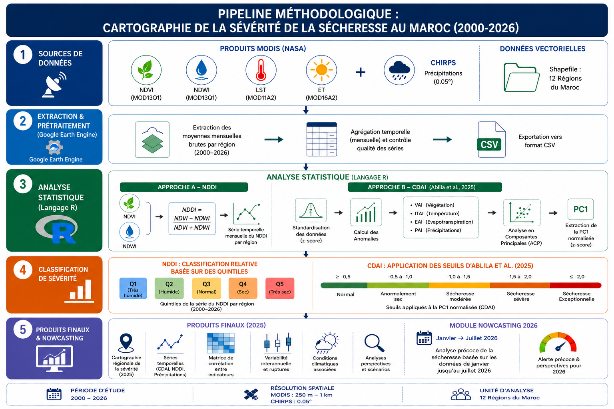
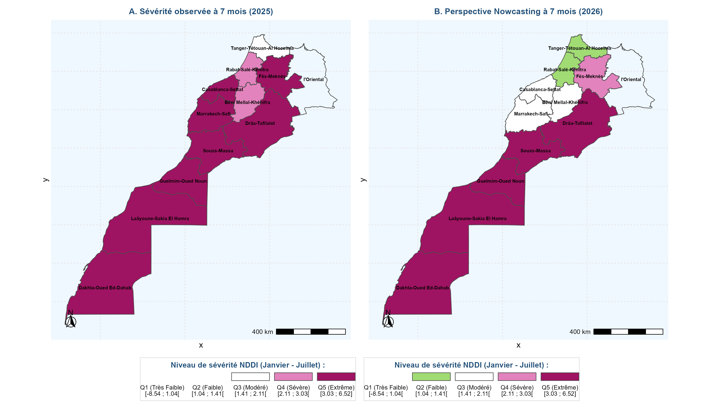
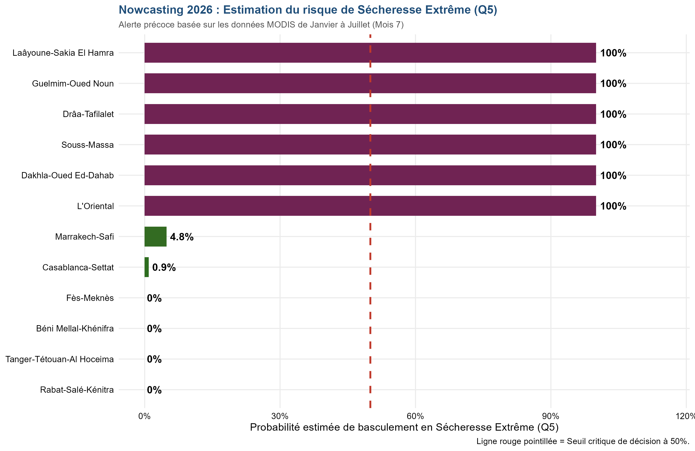

# Cartographie de la sévérité de la sécheresse au Maroc à l’aide des données satellitaires (2000–2026)

## Présentation du projet

Ce dépôt rassemble les codes, traitements, données préparées et productions graphiques développés dans le cadre d’une étude consacrée au **suivi, à la cartographie et à l’anticipation de la sévérité de la sécheresse au Maroc** sur la période **2000–2026**.

Le travail a été réalisé dans le cadre d’un **stage d’application à la Direction des Études et des Prévisions Financières (DEPF) du Ministère de l’Économie et des Finances du Royaume du Maroc**, dans le cadre de la formation d’ingénieur à l’**Institut National de Statistique et d’Économie Appliquée (INSEA), Rabat**.

L’étude couvre les **12 régions administratives du Maroc** et repose principalement sur l’exploitation de données satellitaires et géospatiales, avec une chaîne de traitement combinant **Google Earth Engine (GEE)** pour l’extraction/prétraitement et **R** pour les traitements statistiques, la modélisation et la visualisation.

---

## Objectifs

L’objectif général est de construire un dispositif reproductible permettant de :

- caractériser la dynamique spatio-temporelle de la sécheresse au Maroc ;
- calculer et analyser le **NDVI**, le **NDWI** et le **NDDI** ;
- cartographier la sévérité relative de la sécheresse dans les 12 régions ;
- tenir compte des difficultés liées aux **nuages, pixels aberrants et surfaces peu végétalisées/sols nus**, particulièrement importantes dans les zones arides du Sud ;
- compléter l’approche NDDI par un **Combined Drought Anomaly Index (CDAI)** construit à partir d’une analyse multivariée ;
- identifier les anomalies et épisodes historiques de sécheresse ;
- mettre en œuvre un **nowcasting 2026** à partir des données disponibles au cours de l’année ;
- produire des résultats reproductibles et exploitables pour l’analyse territoriale et l’aide à la décision.

---

## Deux approches complémentaires

### 1. Approche NDDI — approche principale

L’approche principale repose sur la combinaison de deux informations spectrales :

- **NDVI** : état/vigueur de la végétation ;
- **NDWI** : information relative à l’eau/humidité du couvert.

Le NDDI est calculé selon :

$$
NDDI = \frac{NDVI-NDWI}{NDVI+NDWI}
$$

L’analyse est conduite à l’échelle régionale et permet de construire des séries temporelles ainsi que des cartes de sévérité.

### Classification relative

Une difficulté majeure concerne l’utilisation de seuils absolus de NDDI. Les seuils proposés dans la littérature ne sont pas nécessairement transférables à l’ensemble des contextes bioclimatiques marocains, notamment dans les zones arides et très peu végétalisées.

L’étude adopte donc une **classification relative par quintiles**, calculée à partir de la distribution du NDDI, afin de mieux comparer les situations au sein du territoire étudié.

Les cinq classes sont :

| Classe | Interprétation relative |
|---|---|
| Q1 | Très humide / faible sévérité |
| Q2 | Humide / sévérité faible à modérée |
| Q3 | Situation intermédiaire |
| Q4 | Sec / forte sévérité |
| Q5 | Très sec / très forte sévérité |

Cette classification est une **échelle relative** et ne doit pas être interprétée comme une échelle absolue universelle de sécheresse.

---

### 2. Approche CDAI — approche complémentaire

La seconde approche vise à dépasser la lecture univariée du NDDI en considérant simultanément plusieurs dimensions du stress hydrique.

Le protocole comprend notamment :

1. préparation et contrôle des séries ;
2. standardisation des variables ;
3. construction des anomalies standardisées ;
4. analyse en composantes principales (ACP) ;
5. extraction de la première composante principale (**PC1**) ;
6. normalisation de PC1 pour obtenir le CDAI ;
7. analyse des anomalies, épisodes et dynamiques temporelles.

Dans cette étude, le CDAI est principalement mobilisé comme **outil complémentaire d’analyse temporelle et de détection des anomalies**, et non comme source des cartes finales principales du NDDI.

---

## Données mobilisées

La chaîne de traitement s’appuie sur plusieurs sources de données satellitaires et géospatiales :

| Source / produit | Variables principales | Résolution indicative | Usage |
|---|---|---:|---|
| MODIS | NDVI / NDWI | 500 m | NDDI |
| MODIS | NDVI | 250 m | composante végétation du CDAI selon le traitement retenu |
| MODIS | LST | 1 km | composante thermique du CDAI |
| MODIS | ET | 1 km | composante évapotranspiration du CDAI |
| CHIRPS | Précipitations | 0,05° | composante pluviométrique du CDAI |
| Données vectorielles | Limites administratives | — | 12 régions du Maroc |

Les résolutions et fréquences exactes sont à interpréter selon le produit utilisé dans chaque module du pipeline.

---

## Pipeline méthodologique

La chaîne globale peut être résumée en cinq grandes étapes :

1. **Acquisition des données**
2. **Prétraitement et extraction sous Google Earth Engine**
3. **Traitement statistique sous R**
4. **Classification et analyse de la sévérité**
5. **Productions finales et nowcasting 2026**



---

## Nowcasting 2026

Le module de nowcasting vise à produire une information précoce sur le risque de terminer l’année 2026 en **sécheresse extrême (Q5)** à partir des informations disponibles avant la fin de l’année.

Pour cette étude, la fenêtre de nowcasting utilisée couvre les **sept premiers mois de 2026, de janvier à juillet**.

Le modèle de nowcasting repose sur une **régression logistique** calibrée sur l’historique, avec une définition du risque critique à partir du cinquième quintile (Q5). Les caractéristiques cumulées de janvier à juillet sont utilisées pour estimer la probabilité de basculement en sécheresse extrême.

### Résultat du nowcasting à 7 mois





À partir des données disponibles de janvier à juillet 2026, le résultat obtenu met notamment en évidence :

- une probabilité estimée de **100 %** pour **Laâyoune-Sakia El Hamra** ;
- **Guelmim-Oued Noun : 100 %** ;
- **Drâa-Tafilalet : 100 %** ;
- **Souss-Massa : 100 %** ;
- **Dakhla-Oued Ed-Dahab : 100 %** ;
- **L’Oriental : 100 %** ;
- **Marrakech-Safi : 4,8 %** ;
- **Casablanca-Settat : 0,9 %** ;
- **Fès-Meknès, Béni Mellal-Khénifra, Tanger-Tétouan-Al Hoceïma et Rabat-Salé-Kénitra : 0 %**.

Le seuil de décision du modèle est fixé à **50 %**. Le résultat constitue un **nowcast**, et non une observation définitive de l’état de sécheresse de l’ensemble de l’année 2026.

---

## Technologies et environnement

### Google Earth Engine

Utilisé principalement pour :

- l’accès aux données satellitaires ;
- le filtrage et le prétraitement ;
- les masques de qualité ;
- l’agrégation spatiale ;
- l’extraction des séries régionales ;
- l’export des données vers des fichiers exploitables sous R.

### R

Utilisé principalement pour :

- le nettoyage et la préparation des séries ;
- le calcul des indices ;
- la standardisation ;
- l’ACP ;
- la construction du CDAI ;
- la classification relative ;
- la modélisation du nowcasting ;
- la production des graphiques et tableaux analytiques.

---

## Organisation indicative du dépôt

```text
cartographie-severite-secheresse-au-maroc-par-donnees-satellitaires-HR/
│
├── README.md
│
├── GEE/
│   ├── extraction_NDDI/
│   ├── extraction_CDAI/
│   └── preprocessing/
│
├── R/
│   ├── NDDI/
│   ├── CDAI/
│   ├── nowcasting/
│   └── visualisation/
│
├── data/
│   ├── raw/
│   ├── processed/
│   └── shapefiles/
│
├── outputs/
│   ├── cartes/
│   ├── figures/
│   ├── tableaux/
│   └── nowcasting/
│
└── docs/
    ├── pipeline_methodologique.png
    └── nowcasting_2026_7mois.png
```

> Les noms exacts des dossiers et scripts peuvent différer de cette architecture indicative selon la version du dépôt.

---

## Reproductibilité

L’étude a été conçue selon une logique de reproductibilité :

**Données satellitaires → Google Earth Engine → séries régionales → R → indices/anomalies → classification → cartographie et analyses → nowcasting.**

Les traitements statistiques et graphiques doivent être exécutés à partir des données et scripts correspondant à la version du projet utilisée pour les résultats présentés dans le rapport.

---

## Principaux produits générés

Le projet permet notamment de produire :

- séries temporelles régionales de NDVI, NDWI et NDDI ;
- cartes régionales de sévérité du NDDI ;
- classifications relatives par quintiles ;
- analyses de fréquence, intensité et dynamique de la sécheresse ;
- séries temporelles du CDAI ;
- diagnostics issus de l’ACP ;
- analyses d’anomalies et d’épisodes historiques ;
- comparaisons interrégionales ;
- graphiques de conditions hydro-climatiques ;
- résultats de nowcasting 2026 ;
- tableaux et figures destinés au rapport scientifique.

---

## Limites méthodologiques importantes

Le projet doit être interprété en tenant compte de plusieurs limites :

1. **Le NDDI est sensible au contexte biophysique.** Les surfaces très peu végétalisées et les sols nus peuvent modifier son interprétation, en particulier dans les régions arides du Sud.
2. **La classification par quintiles est relative.** Elle facilite la comparaison au sein de la série étudiée mais ne constitue pas une échelle universelle de sécheresse.
3. **2026 est une année partielle.** Les résultats de nowcasting sont construits avec les données disponibles de janvier à juillet 2026.
4. **Le nowcasting est probabiliste.** Une probabilité élevée indique un risque estimé de franchissement du seuil Q5, et non une observation certaine de la situation finale de décembre.
5. **Les deux approches répondent à des objectifs complémentaires.** Le NDDI est privilégié pour la lecture spatiale et la cartographie relative, tandis que le CDAI apporte une lecture multivariée et temporelle des anomalies.

---

## Références méthodologiques principales

- **Boumahdi, I. & González Pandiella, A. (2026).** *Mapping Drought Severity in Mexico Using High-Resolution Satellite Data*. OECD Economics Department Working Papers, No. 1862.
- **Ablila, Y., Er-Raki, S., Bouras, E. H., Amazirh, A., Khabba, S., Balaghi, R., et al. (2025).** *Combined Drought Anomaly Index (CDAI) for Agricultural Drought Monitoring in Morocco*. Earth Systems and Environment.
- **Organisation météorologique mondiale (OMM) & Global Water Partnership (GWP) (2016).** *Manuel des indicateurs et indices de sécheresse*.

---

## Auteurs

**GUERGOU GAGARA Abdoul-Samah**  
Élève ingénieur en Economie Appliquée Statistique et Big Data — Institut National de Statistique et d’Économie Appliquée (INSEA), Rabat

**AOUISSI Saesso Medard Junior Jojo**  
Élève ingénieur en Biostatistique Démographie et Big Data — Institut National de Statistique et d’Économie Appliquée (INSEA), Rabat

---

## Institution d’accueil

**Direction des Études et des Prévisions Financières (DEPF)**  
**Ministère de l’Économie et des Finances de Royaume du Maroc**

---

## Licence et utilisation

Ce dépôt est destiné à la documentation et à la reproductibilité du travail scientifique réalisé dans le cadre du stage. Toute réutilisation des données provenant de sources externes doit respecter les conditions de licence et de citation propres aux fournisseurs concernés.
